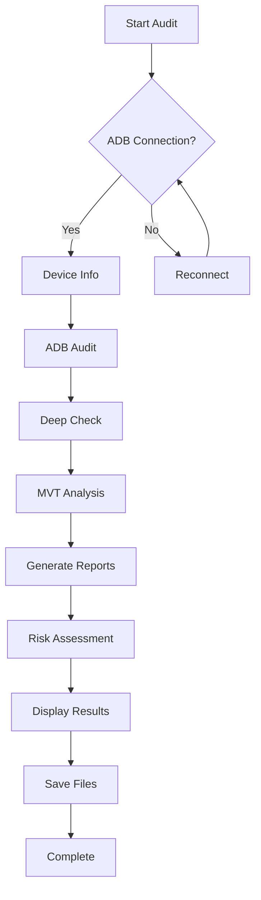
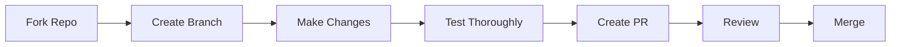

# 🔐 Markush_audit - Master Security Audit Tool

> **A comprehensive Android security audit framework combining ADB commands, deep-level security checks, and Mobile Verification Toolkit (MVT) for nation-state spyware detection.**

---

<div align="center">


*Comprehensive security audit covering multiple layers of Android device protection*


*Visual representation of compromised phone detection and security analysis*


*Four types of device lock security - Face Recognition, Pattern Lock, PIN/Number Lock, and Fingerprint Authentication*

---

[](d/main.mp4)

*Click to watch the complete video tutorial demonstrating full code usage and workflow*

---

## 📦 **Status Badges**


-lightgrey.svg)


[](http://makeapullrequest.com)
[](https://github.com/Thunder9954/Audit/graphs/commit-activity)
[](https://github.com/Thunder9954/Audit/issues)
[](https://github.com/Thunder9954/Audit/stargazers)

---

## 📋 **Table of Contents**

- [Overview](#-overview)
- [Features](#-features)
- [Technology Stack](#-technology-stack)
- [Quick Start](#-quick-start)
- [Installation Guide](#-installation-guide)
- [Usage Guide](#-usage-guide)
- [Output Structure](#-output-structure)
- [MVT Integration](#-mvt-integration)
- [Security Notes](#-security-notes)
- [Troubleshooting](#-troubleshooting)
- [Professional Help](#-professional-help)
- [Roadmap](#-roadmap)
- [Contributing](#-contributing)
- [License](#-license)
- [Contact](#-contact)

---

## 🎯 **Overview**

**Markush_audit** is a powerful, modular security auditing framework designed for Android devices. It combines three distinct security analysis layers:

1. **🔍 ADB Security Audit** - Comprehensive device and application analysis
2. **🛡️ Deep-Level Security Check** - Kernel, system, and network-level inspection
3. **🦠 MVT Integration** - Nation-state spyware detection using threat intelligence

### ✨ Key Highlights

- **Non-invasive** - Performs only read operations on your device
- **Modular** - Run each audit section independently
- **Comprehensive** - Analyzes from application layer to kernel level
- **Intelligent** - Risk assessment and threat prioritization
- **Exportable** - Human-readable and machine-parseable output formats

---

## 🚀 **Features**

### 🔍 **ADB Security Audit Module**

| Category | Features |
|----------|----------|
| **📱 Apps Analysis** | Complete package inventory, Sideloaded app detection, Application types |
| **🔐 Permissions Check** | Camera, Microphone, Location, SMS, Calls, Contacts monitoring |
| **⚙️ Security Settings** | Developer options, USB debugging, Unknown sources, Mock location |
| **🔄 Access Control** | Accessibility services, Device admins, Notification listeners |
| **🖥️ System Status** | Overlay permissions, Running processes, VPN/Proxy status |
| **🏢 Enterprise Detection** | Work profile, MDM (Mobile Device Management) checks |

### 🛡️ **Deep-Level Security Check**

| Category | Features |
|----------|----------|
| **🧠 Kernel Analysis** | Version, Build date, Architecture, Compiler information |
| **🔒 Bootloader Status** | Verified boot, Build type, OEM unlock, Build tags |
| **🔐 SELinux Policy** | Enforcing status, Policy version, Domain configurations |
| **📊 Process Monitoring** | Root processes, Suspicious process names, Privilege escalation |
| **🌐 Network Security** | Listening ports, Established connections, Backdoor detection |
| **📡 Baseband/Modem** | Version, RIL implementation, Network type, Operator info |
| **🔌 Kernel Modules** | Loaded modules, Suspicious module detection, Module signatures |
| **⚙️ System Properties** | Security-relevant properties, Debuggable status, Fingerprinting |
| **💾 Filesystem Integrity** | Mount status, Remount flags, dm-verity mode, Filesystem types |
| **📈 Tracing Status** | Kernel tracing, Surveillance detection, Performance monitoring |

### 🦠 **MVT Integration**

Detection against **16+** threat intelligence feeds:

| Threat Name | Type | Target Platform |
|-------------|------|-----------------|
| **NSO Group Pegasus** | Spyware | iOS/Android |
| **Predator** (Intellexa) | Advanced Surveillance | Android |
| **RCS Lab** | Italian Spyware | Android |
| **Stalkerware** | Domestic Abuse Tools | Android |
| **Quadream KingSpawn** | Exploit | iOS |
| **Operation Triangulation** | Zero-click Exploit | iOS |
| **WyrmSpy/DragonEgg** | Android Spyware | Android |
| **Wintego Helios** | Mobile Surveillance | Mobile |
| **NoviSpy** (Serbia) | Balkan Region Spyware | Android |
| **Candiru** (DevilsTongue) | Mercenary Spyware | Mobile |
| **ResidentBat** | Advanced Persistent Threat | Mobile |
| **Cellebrite** | Forensic Tool Detection | Mobile |
| **DarkSword** | Surveillance Malware | Mobile |
| **Coruna** | Mobile Threat | Mobile |
| **Morpheus** | Spyware Framework | Mobile |
| **BTMOB** | Bluetooth-based Threats | Mobile |
| **Spyrtacus** | Emerging Threats | Mobile |

---

## 🛠️ **Technology Stack**

### Core Technologies


### Python Libraries
```
📦 cryptography     - Cryptographic operations and secure hashing
📦 requests         - HTTP requests for IOC downloads
📦 pydantic         - Data validation and settings management
📦 rich             - Rich terminal formatting and output
📦 click            - Command-line interface creation
📦 PyYAML           - YAML configuration parsing
📦 subprocess       - System command execution
📦 virtualenv       - Isolated Python environment
```

### Security Tools
```
🛡️ MVT              - Mobile Verification Toolkit
📊 IOC Feeds         - 16+ Threat Intelligence Sources
🔒 SELinux           - Security-Enhanced Linux policy analysis
🧠 Kernel Analysis   - Low-level system inspection
🌐 Network Tools     - netstat/ss, ps, getprop, dumpsys, pm
```

### System Requirements
```
💻 OS: Linux, macOS, or Windows (WSL2)
🐍 Python: 3.7 or higher
📱 ADB: System-wide installation
🔌 USB Cable: For device connection
🌐 Internet: For MVT IOC downloads
```

---

## ⚡ **Quick Start**

```bash
# Clone the repository
git clone https://github.com/Thunder9954/Audit.git
cd Audit

# Install dependencies
pip install -r requirements.txt

# Run the audit
python3 manage.py
```

---

## 📖 **Installation Guide**

### Step 1: Install ADB

<details>
<summary><b>🐧 Linux (Debian/Ubuntu)</b></summary>

```bash
sudo apt update
sudo apt install adb
```
</details>

<details>
<summary><b>🍎 macOS</b></summary>

```bash
brew install android-platform-tools
```
</details>

<details>
<summary><b>🪟 Windows</b></summary>

Download from: https://developer.android.com/studio/releases/platform-tools
</details>

### Step 2: Verify ADB Installation
```bash
adb version
# Should display: Android Debug Bridge version 1.0.41 or higher
```

### Step 3: Enable USB Debugging on Android

1. **Enable Developer Options:**
   - Settings → About Phone → Tap "Build Number" 7 times
   
2. **Enable USB Debugging:**
   - Settings → Developer Options → Enable "USB Debugging"
   - Enable "Stay Awake" (optional, for screen-on during audit)

3. **Connect Device:**
   ```bash
   adb devices
   # Accept the authorization popup on your phone
   ```

### Step 4: Clone or Download Project
```bash
git clone https://github.com/Thunder9954/Audit.git
cd Audit
```

### Step 5: Install Python Dependencies

```bash
# With specific versions (recommended for stability)
pip install -r requirements.txt

# Or with latest versions
pip install -r requirementsV.txt
```

> **💡 Note:** MVT will be auto-installed in a virtual environment when first used.

---

## 💻 **Usage Guide**

### 🚀 **Basic Usage**

```bash
python3 manage.py
```

### ⚙️ **Configuration**

When prompted, enter the delay between commands:
- **Default**: 0.5 seconds
- **Purpose**: Prevent overwhelming ADB connection
- **Recommendation**: Use default unless experiencing connection issues

### 📝 **Interactive Prompts**

```
┌─────────────────────────────────────────────────────────┐
│  🔐 MARKUSH AUDIT - MASTER SECURITY AUDIT TOOL         │
│  Creator: Purn Vadodariya                             │
│  Contact: purn872008@gmail.com                       │
│  GitHub: https://github.com/Thunder9954/Audit        │
└─────────────────────────────────────────────────────────┘

📱 Connected device: [Device Model] - Android [Version]
🔐 Security patch level: [Date]
💻 API level: [Number]

⏱️  Enter delay between commands (default 0.5s): 

[1/3] 🔍 ADB SECURITY AUDIT
  📋 Apps analysis, permissions, settings, access control
  Run ADB security audit? [Y/n]: y

[2/3] 🛡️ DEEP-LEVEL SECURITY CHECK
  🔧 Kernel, bootloader, SELinux, network, processes
  Run deep-level security check? [Y/n]: y

[3/3] 🦠 MOBILE VERIFICATION TOOLKIT (MVT)
  🌍 Nation-state spyware detection using threat intelligence
  Run MVT analysis? [Y/n]: y
```

### 📊 **Audit Flow**



---

## 📂 **Output Structure**

### Directory Layout
```
audit_runs/
└── run_20260819_191147/
    ├── 📄 adb_audit_report_20260819_191446.txt
    ├── 📄 deep_security_report_20260819_191512.txt
    ├── 📄 mvt_report_20260819_191925.txt
    ├── 📄 master_security_audit_20260819_191932.txt
    ├── 📄 master_security_audit_20260819_191932.json
    ├── 📦 bugreport_20260819_191800.zip
    └── 📁 mvt_results/
        ├── 📄 alerts.json
        ├── 📄 alerts_timeline.csv
        └── 📄 dbinfo.json
```

### Report Specifications

<details>
<summary><b>📄 ADB Audit Report</b></summary>

- Device information (model, Android version, security patch)
- Developer settings status
- Complete package list with details
- Sideloaded apps (non-Play Store)
- Apps with dangerous permissions
- Accessibility services
- Device administrators
- Notification listeners
- Overlay permissions
- Running processes
- VPN/proxy status
- Work profile/MDM status
</details>

<details>
<summary><b>📄 Deep Security Report</b></summary>

- Kernel version and build information
- Bootloader status and verified boot
- SELinux status and policy
- Process analysis (root/suspicious processes)
- Network connections and listening ports
- Baseband/modem information
- Kernel modules analysis
- System properties security check
- Filesystem integrity
- Tracing status
- Risk assessment (High/Medium/Low)
</details>

<details>
<summary><b>📄 MVT Report</b></summary>

- Total alerts count
- Alerts by severity (CRITICAL, HIGH, MEDIUM, LOW, INFORMATIONAL)
- Matched indicators of compromise
- Detailed alert timeline
- Module-specific findings
- IOC hit analysis
</details>

<details>
<summary><b>📄 Master Security Audit Report</b></summary>

- Consolidated summary of all audits
- Risk assessment overview
- Recommendations
- JSON export for programmatic access
</details>

---

## 🦠 **MVT Integration**

### What is MVT?
**MVT (Mobile Verification Toolkit)** is an open-source tool developed by Amnesty International's Security Lab to detect signs of compromise on mobile devices. It uses threat intelligence feeds to identify indicators of nation-state spyware.

### 🔗 IOC Sources
MVT downloads indicators from **16+** threat intelligence feeds:

| Source | Type | Target |
|--------|------|--------|
| NSO Group Pegasus | Commercial Spyware | iOS/Android |
| Predator (Intellexa) | Advanced Spyware | Android |
| RCS Lab | Italian Spyware | Android |
| Stalkerware | Domestic Abuse | Android |
| Quadream KingSpawn | iOS Exploit | iOS |
| Operation Triangulation | Zero-click | iOS |
| WyrmSpy/DragonEgg | Spyware | Android |
| Wintego Helios | Surveillance | Mobile |
| NoviSpy | Balkan Spyware | Android |
| Candiru (DevilsTongue) | Mercenary | Mobile |
| ResidentBat | APT | Mobile |
| Cellebrite | Forensic Tool | Mobile |
| DarkSword | Malware | Mobile |
| Coruna | Threat | Mobile |
| Morpheus | Spyware | Mobile |
| BTMOB | Bluetooth | Mobile |
| Spyrtacus | Emerging | Mobile |

### 🔧 MVT Installation
The tool automatically installs MVT in a virtual environment:
```bash
python-pip/  # Virtual environment directory
```

### 📊 Bug Report Generation
- Generated via `adb bugreport`
- Takes 1-5 minutes depending on device
- Requires screen to be ON and UNLOCKED
- Contains comprehensive system state

---

## 🔒 **Security Notes**

### 🛡️ Data Privacy
- ✅ **Read-Only Operations**: Tool performs only read checks, no device modifications
- ✅ **Local Analysis**: All analysis performed locally on your computer
- ✅ **No External Data Transmission**: No data sent to external servers (except MVT IOC downloads from official sources)
- ✅ **Report Content**: Reports contain package names, permissions, and system information only
- ✅ **Personal Data Protection**: Contacts, messages, and personal content are NOT included in reports

### ⚠️ Safe Usage
- Tool does not install any malware or spyware
- Virtual environment isolates MVT installation
- No persistent changes to device
- No root or modification required

### 🚫 Limitations
The tool cannot detect:
- Kernel/firmware-level nation-state spyware that leaves no traces
- Zero-click exploits that only exist in RAM
- Hardware-level compromises
- Baseband/modem implants
- Advanced persistent threats with sophisticated evasion

> **For these advanced threats, seek professional forensic analysis.**

---

## 🛠️ **Troubleshooting**

### 📱 ADB Connection Issues

<details>
<summary><b>Device not found or unauthorized</b></summary>

**Solutions:**
1. Check USB cable (use original or high-quality cable)
2. Try different USB port (direct connection, not through hub)
3. Re-enable USB debugging on device
4. Restart ADB server:
   ```bash
   adb kill-server && adb start-server
   ```
5. Check device authorization:
   ```bash
   adb devices
   ```
6. Revoke USB debugging authorization and re-accept
</details>

<details>
<summary><b>Device offline</b></summary>

**Solutions:**
1. Disconnect and reconnect USB cable
2. Toggle USB debugging off and on
3. Restart device
4. Check USB cable for damage
</details>

### 🦠 MVT Installation Issues

<details>
<summary><b>MVT installation fails</b></summary>

**Solutions:**
1. Ensure Python 3.7+ is installed:
   ```bash
   python3 --version
   ```
2. Check internet connection (required for package downloads)
3. Verify virtual environment creation:
   ```bash
   ls python-pip/
   ```
4. Manual installation:
   ```bash
   python3 -m venv python-pip
   source python-pip/bin/activate
   pip install mvt
   ```
</details>

<details>
<summary><b>IOC download fails</b></summary>

**Solutions:**
1. Check internet connection
2. Verify MVT installation:
   ```bash
   source python-pip/bin/activate
   mvt-android version
   ```
3. Retry download (may be temporary server issue)
</details>

### 🔧 Permission Issues

<details>
<summary><b>Permission denied errors</b></summary>

**Solutions:**
1. Ensure ADB has proper permissions
2. On Linux, add user to plugdev group:
   ```bash
   sudo usermod -aG plugdev $USER
   ```
3. Restart ADB server after group change
</details>

### 💾 Memory/Storage Issues

<details>
<summary><b>Out of memory during bug report generation</b></summary>

**Solutions:**
1. Close other applications
2. Ensure sufficient disk space (500MB+)
3. Use smaller delay between commands
</details>

---

## 🚨 **Professional Help**

If MVT detects indicators of compromise or you suspect targeted surveillance:

### 🌍 Amnesty International Security Lab
- **Website**: https://securitylab.amnesty.org/get-help/
- **Services**: Free forensic analysis for human rights defenders
- **Contact**: securitylab@amnesty.org

### 🛡️ Digital Defenders Partnership
- **Website**: https://digitaldefenders.org/
- **Services**: Emergency response for digital attacks
- **Hotline**: Available for urgent cases

### 📱 Access Now
- **Website**: https://www.accessnow.org/help/
- **Services**: Digital security support for at-risk users
- **Helpline**: 24/7 emergency response

### 🔬 Citizen Lab
- **Website**: https://citizenlab.ca/
- **Services**: Research and analysis of digital threats

---

## 🗺️ **Roadmap**

### ✅ **Version 1.0.0** (Current)
- [x] ADB security audit module
- [x] Deep-level security checks
- [x] MVT integration
- [x] Comprehensive reporting
- [x] Risk assessment
- [x] JSON export

### 🚧 **Version 2.0.0** (Planned)

| Feature | Status | Priority |
|---------|--------|----------|
| 🌐 Web-based dashboard | 🟡 In Development | High |
| 🤖 Automated scheduling | 🟢 Planned | Medium |
| ☁️ Cloud report storage | 🟢 Planned | Medium |
| 📱 Multi-device support | 🟢 Planned | High |
| 📊 Real-time monitoring | 🟢 Planned | Medium |
| 🧠 ML threat detection | 🟢 Planned | Low |
| 🔗 SIEM integration | 🟢 Planned | Low |
| 📱 Mobile app companion | 🟢 Planned | Medium |

---

## 🤝 **Contributing**

Before making changes to this security audit tool:

1. **Understand Security Implications**
   - Changes could affect detection capabilities
   - Consider privacy implications
   - Test thoroughly before deployment

2. **Testing Requirements**
   - Test on multiple Android versions
   - Verify no data leakage
   - Ensure backward compatibility

3. **Code Standards**
   - Follow existing code style
   - Add documentation for new features
   - Update README accordingly

4. **Privacy Protection**
   - Maintain user privacy
   - No data collection without consent
   - Secure handling of sensitive information

### 📝 **Contribution Process**



---

## 📜 **License**

<div align="center">

**MIT License**

Copyright © 2024 Purn Vadodariya

</div>

Permission is hereby granted, free of charge, to any person obtaining a copy
of this software and associated documentation files (the "Software"), to deal
in the Software without restriction, including without limitation the rights
to use, copy, modify, merge, publish, distribute, sublicense, and/or sell
copies of the Software, and to permit persons to whom the Software is
furnished to do so, subject to the following conditions:

The above copyright notice and this permission notice shall be included in all
copies or substantial portions of the Software.

**THE SOFTWARE IS PROVIDED "AS IS", WITHOUT WARRANTY OF ANY KIND, EXPRESS OR
IMPLIED, INCLUDING BUT NOT LIMITED TO THE WARRANTIES OF MERCHANTABILITY,
FITNESS FOR A PARTICULAR PURPOSE AND NONINFRINGEMENT. IN NO EVENT SHALL THE
AUTHORS OR COPYRIGHT HOLDERS BE LIABLE FOR ANY CLAIM, DAMAGES OR OTHER
LIABILITY, WHETHER IN AN ACTION OF CONTRACT, TORT OR OTHERWISE, ARISING FROM,
OUT OF OR IN CONNECTION WITH THE SOFTWARE OR THE USE OR OTHER DEALINGS IN THE
SOFTWARE.**

---

## 📞 **Contact**

<div align="center">

### 👨‍💻 **Creator**

**Purn Vadodariya**

[](mailto:purn872008@gmail.com)
[](https://github.com/Thunder9954/Audit)

</div>

### 📬 **Support Channels**

- **🐛 Bug Reports**: Email with detailed description and logs
- **💡 Feature Suggestions**: Email with use case description
- **📖 Documentation**: Pull requests welcome
- **❓ Questions**: Open an issue or email

---

## 🙏 **Acknowledgments**

### 🏢 **Organizations**
- **Amnesty International Security Lab** - MVT development and threat intelligence
- **Android Open Source Project** - ADB tools and documentation
- **Security Research Community** - Threat intelligence and IOC feeds
- **Python Community** - Excellent libraries and tools

### 👥 **Contributors**
- Security researchers worldwide
- Open-source community contributors
- Beta testers and early adopters

---

## 📚 **Additional Resources**

### 📖 **Documentation**
- [Android Security Documentation](https://source.android.com/security)
- [MVT Documentation](https://github.com/mvt-project/mvt)
- [ADB Guide](https://developer.android.com/studio/command-line/adb)

### 🌍 **Security Communities**
- [Amnesty Security Lab](https://securitylab.amnesty.org/)
- [Citizen Lab](https://citizenlab.ca/)
- [EFF Surveillance Self-Defense](https://ssd.eff.org/)

### 🔧 **Related Tools**
- [MobSF](https://github.com/MobSF/Mobile-Security-Framework-MobSF)
- [AndroBugs](https://github.com/AndroBugs/)
- [QARK](https://github.com/linkedin/qark)

---

<div align="center">

## ⚠️ **Important Disclaimer**

**This tool is for legitimate security auditing only. Unauthorized access to devices is illegal. Use only on devices you own or have explicit permission to audit.**

---

**Made with ❤️ for a safer digital world**

[⬆ Back to Top](#-markush_audit---master-security-audit-tool)

</div>
